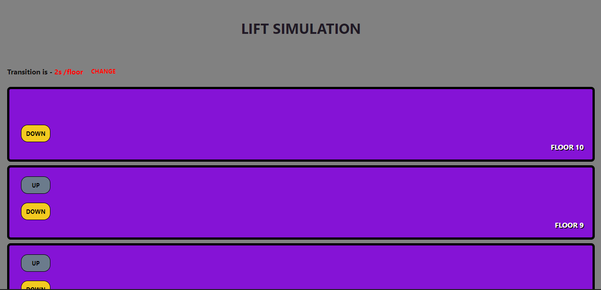
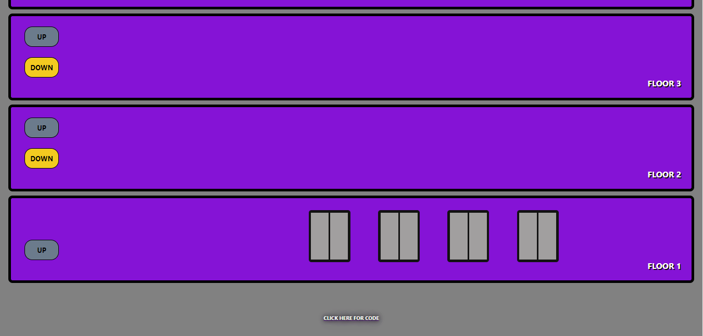

<h1>Lift Simulation Webapp</h1>

 
    A web app that can simulate lift mechanics using HTML, CSS and vanilla JavaScript(
        <a href="https://lift-simulation-abhinav.netlify.app/">Link </a>
        to the webpage)

<h2>Preview:</h2>

    
    

 